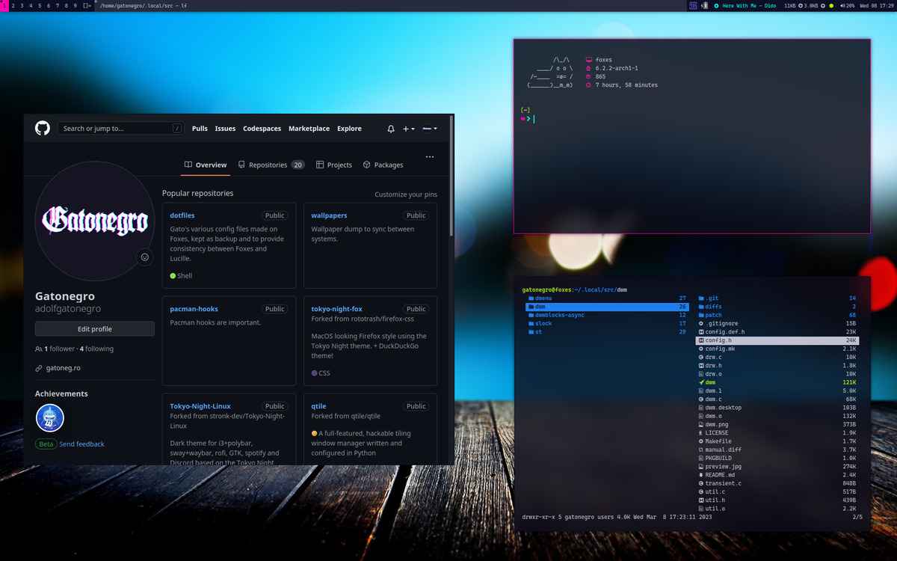

# Gatonegro's dwm

Custom build of [dwm](https://dwm.suckless.org/).

## Patches

+ **alpha** adds transparency to the status bar.
+ **actualfullscreen** actually fullscreens a window, instead of just hiding
  the statusbar and applying the monocle layout.
+ **attachbelow** adds new clients below the active client.
+ **bar_height** allows the bar height to be declared explicitly.
+ **center_transient_windows** aligns transient windows to the centre of the screen.
+ **cyclelayouts** cycles through all available layouts.
+ **dwmblocks** status bar (using `dwmblocks-async`).
+ **fancybar**[optional] shows the titles of all visible windows on the status bar.
+ **movestack** enables moving clients up and down the stack.
+ **noborder** removes the border when only one client window is visible.
+ **pertag** allows each tag to have its own layout, nmaster, etc.
+ **resizecorners** allows resizing a window from whichever corner is closest
  to the cursor instead of only the bottom right corner.
+ **restartsig** allows `dwm` to be restarted instead of needing to log out.
+ **scratchpads** adds floating scratchpad windows.
+ **seamlessrestart** retains layouts, tags, nmaster, etc., across restarts.
+ **statuscmd** makes status elements clickable.
+ **shiftview_clients** cycles only through tags with visible clients.
+ **status2d** adds colour support to the status bar, includes **xrdb** support.
+ **sticky** tags windows to be visible on all tags.
+ **swallow** lets terminals swallow windows opened by a child process.
+ **systray** adds a systray to the status bar.
+ **togglelayout** enables the previous layout if the current layout's key is pressed.
+ **vanitygaps** adds configurable gaps between windows.
+ **xrdb** reads colours from Xresources at runtime.

## Layouts

+ **tile**
+ **monocle**
+ **gridmode**
+ **deck**
+ **bstack**
+ **centeredmaster** (disabled by default)

## Extra features

+  Autostart function in `dwm.c` to launch or refresh `dwmblocks` whenever `dwm`
  (re)starts.
+ `systrayiconsize` added to `bar_systray.c` to allow explicitly declaring an
  icon size in `config.h` instead of calculating them from the font size.
+ Modified `width_systray` function in `bar_systray.` to reduce horizontal
  padding.
+ Modified `view` function to return to previously selected tag is the current
  tag key is pressed again.
+ Added `KeyPressMask` to `wa.event_mask` in `dwm.c` to retain media key
  functionality even when `slock` is active.
+ Reverted upstream commit [`712d633`](https://git.suckless.org/dwm/commit/712d6639ff8e863560328131bbb92b248dc9cde7.html)
  as it was causing some programs (e.g. `mpv`) to fail when called from a
  script that was run via key bindings.
+ Added `float_and_center`, similar to `togglefloating` but it will resize and
  move the client window to the centre of the screen.
